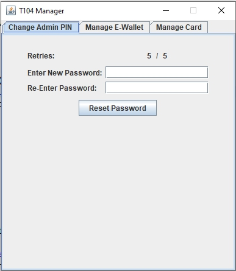
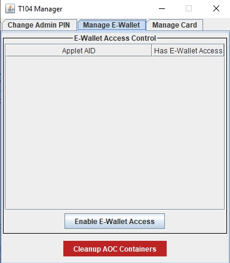

# Developer Guide #

## Developing and Testing on Card ##
Development of applets maybe carried out on the T104 card but care must be taken as the card needs to be powered on to allow access to the NFC for managing the applets on the cards as well as interacting with the applets on the card.

The default timeout set on the card is 5 minutes before a forced timeout and shutdown of the card is executed.

Developers may choose to increase the timeout time using the T104 Manager or to simply disable the timeout on the card.

Disabling the timeout on the card has the risk of draining the battery power on the card and forgetting to switch off the card when not in use.

## Displaying Arbitrary Integers and Decimals ##
The T104 open API allows writing arbitrary positive integer and postive two-decimal placed decimals to the display of the T104 card.

Arbitrary positive integer and positive two-decimal placed decimal display is done via the following API call:

> `public void displayToScreen(byte[] input, short off, short len, byte[] ticket, short ticketOff);`

The following requirements must be met for rendering:
* Either a 8 digit positive integer or a two-decimal placed positive decimal with the the numbers before the decimal place up to 6 digit place.
* The maximum positive two-decimal placed decimal value shall be `999999.99` and the smallest value shall be `0.00`.
* Encoding of the input shall be in hexadecimal value.
* Example of value `999999.99` shall be encoded in hexadecimal as input as `3939393939392E3939`.

## E-Wallet Development ##
The E-Wallet feature is a separate feature from the arbitrary display of numbers operating in a partially related manner.

The E-Wallet module has three global value storage slots to store values for 'Balance', 'Payment' and 'Loaded Funds' related amount. These amount will need to be accessed and displayed on demand whenever the user powers on the cards.

Applets have to follow these steps to utilize the global stored value: 
1. Manually retrieve the value(s) of the targeted slot(s)
2. Convert them to a format that their applets could process (i.e. to short, int or BigNumber types)
3. Perform the required logical operations in their own applets
4. Convert the results of the logical operations for each of the global value(s) they wish to update
5. Write the updated value(s) to the slot(s)

Applets shall use the following method to retrieve the value(s) from the slot(s) one at a time:
> `public short getGlobalWalletAmount(byte type, byte[] output, short off, byte[] ticket, short ticketOff);`

The returned result would be in hexadecimal representation of the value:
> `3939393939392E3939` for '999999.99' as an example.

Applets shall use the following method to write one or more value(s) from the slot(s) and specify a default slot to display upon successfully performing the value write operation to all the slot(s):
> `public short setGlobalWalletAmount(byte displayWalletRecordSlot, byte[] balance, short balanceOff, short balanceLen, byte[] payment, short paymentOff, short paymentLen, byte[] loading, short loadingOff, short loadingLen, byte[] ticket, short ticketOff);`

The format and rules for the writing of values is the same as displaying arbitrary numbers and decimals.

The `displayWalletRecordSlot` variable shall use the following:
* `T104OpenAPI.WALLET_BALANCE_RECORD_SLOT` - Displays Balance slot upon successful write operation.
* `T104OpenAPI.WALLET_PAYMENT_RECORD_SLOT` - Displays Payment slot upon successful write operation.
* `T104OpenAPI.WALLET_LOADING_RECORD_SLOT` - Displays Loaded Funds slot upon successful write operation.

Upon successful updating of the slots, the values are stored persistently and powering up the card will allow on-demand access to these values displayed on screen via toggling the E-Wallet scrolling mechanical button.

## Calling the Open API ##
To call any of the Open API methods, these following pre-requisite steps must be fulfilled.
1. Applet must get a Shareable Instance of the T104OpenAPI
2. Call once the `createAOCContainer()` to create a Applet Object Container (AOC) instance with a supplied PIN / secret key that will be used for HMAC-SHA256 challenge-response protocol
3. Perform `appLogin()` once to establish a session via a HMAC-SHA256 digital signing of a challenge generated by the T104 Applet.
4. Store the T104 Applet issued session challenge as a session ticket.
5. Call the API with the session ticket to authenticate the API call.

## Registering the AOC Container ##
A Shareable Interface of T104OpenAPI must first be requested. Any applet may request this interface. A PIN, password or secret key up to length of 64 bytes maybe used as the authenticator.

    // AID of T104 Applet
    byte[] serverAID = new byte[] { (byte) 0x4B, (byte) 0x4D, (byte) 0x31, (byte) 0x30, (byte) 0x34, (byte) 0x00 };

    // PIN for API
    byte[] aocPIN = new byte[] { (byte) 0x31, (byte) 0x31, (byte) 0x31, (byte) 0x31, (byte) 0x31, (byte) 0x31, (byte) 0x31, (byte) 0x31};

    // Max pin retry before locking occurs
    short maxRetry = (short) 5;

    // Lookup T104 Applet AID
    AID apiAID = JCSystem.lookupAID(serverAID, (short) 0, (byte) serverAID.length);

    // Get the Shareable Interface
    KM104.T104OpenAPI api = (KM104.T104OpenAPI) JCSystem.getAppletShareableInterfaceObject(apiAID, (byte) 0);

	// Check if Shareable Interface has been fetched
    if (api == null) {
        // TODO: Do something if fail
    } else {
        // Copy to APDU Buffer or some global byte array buffer
        Util.arrayCopyNonAtomic(aocPIN, (short) 0, apduBuf, (short) 0, (short) aocPIN.length);

        // Register for AOC Container        
        if (!api.createAOCContainer(T104OpenAPI.CRED_AUTHTYPE_PIN, apduBuf, (short) 0, aocPIN.length, maxRetry)) {
            // TODO: Do something if fail
        }
    }
    
Storage of AOC authenticator maybe in a `Key` object or simply as a byte array.

It is advisable to make the authenticator as unpredictable as possible unless you want to recover access to the AOC container between periods of uninstalling and installing an applet for a possible applet upgrade.

## Destroying the AOC Container ##
It is advisable to call for destruction of AOC container under these two circumstances:
1. During creation of new AOC container, there might be an existing entry that is unusable as the PIN/Password/Secret Key authenticator is lost or not known, it is advisable to call for destruction of any known AOC container registered to the same AID + RID.

2. It is advisable to extend the `Applet` class with `AppletEvent` and implement the `uninstall()` method which triggers the destruction of the AOC container.

API Call:

* `public boolean destroyAOCContainer();`


## Managing the AOC Container ##
Management of AOC container only allows the changing of PIN/Password/Secret Key used to authenticate the applet to the API.

Maximum authenticator length is 64 bytes.

This function can only be called after successful login of applet to T104 API session as you will need a valid session ticket to proceed further.

API Call:
* `public boolean manageAOCContainer(byte fieldType, byte[] input, short offset, short len, short maxRetry, byte[] ticket, short ticketOff);`

The `fieldType` variable shall use the following:
* `T104OpenAPI.CRED_FIELD_SECRET` - Perform management to authenticator secret.

## API Session Authentication and Security ##
### T104 Environment Security Level
There are two levels of security for the API access. The basic level of security allows any registered applet to access including arbitrary display or integers and decimals. The advanced level of security reserves the access of the E-Wallet function to selected applets. The T104 Manager access is required to assign or unassign an already registered applet with the access to the advanced security level giving the E-Wallet function access rights to the registered applet.

Security Levels:
* Level 1 - All API calls except E-Wallet calls
* Level 2 - All API calls including E-Wallet calls

This arrangement prevents all applets from having access to the E-Wallet module for security reasons. The T104 may have applets operating at different security levels securely without additional T104 cards issued for different purposes (i.e. a eID card seperate from a payment card). 

Issuers may also open access to the T104 card more freely to other developers.

### Applet Session Authentication ###
Applets are required to submit a secret in the form of a PIN or Password. PIN type secrets upon declaration would need to be numerical PIN numbers while Password type secrets accepts any 8-bit byte octets as an input. If a randomly generated secret is used, Pasword should be chosen.

Both types of secrets have a maximum length of 64 byte.

Upon successful registration of applet to the T104 environment, a HMAC-SHA256 based challenge response would be required to authenticate the applet for other API calls.

Authentication steps:
1. Call `appLogin(byte[] param, short paramOffset, short paramLen)` for the first time with the parameter using the APDU buffer or some global byte array. It should return a challenge that is `T104OpenAPI.AUTH_TICKET_LEN` long (10 bytes of challenge for now).

2. Use the PIN/Password as the secret key and challenge as the message in a HMAC-SHA256 signature.

	`Signature = HMAC-SHA256(Key=PIN/Password, Message=Challenge);`

3. Load only the signature from the HMAC-SHA256 into the parameter for `appLogin` and call the `appLogin` again. Below are the return status.

    ```
    1: Success
    2: Fail
    3: Error occurred
    ```

4. If successful, cache the original challenge as the session ticket and use it whenever a `ticket` parameter is required.

5. An example of using a session ticket after successful login:

	```
    // Display some numbers to screen
    private boolean displayToScreen(byte[] input, short off, short len, byte[] apduBuf, short apduBufOff, byte[] buff, short buffOff, short sbuff) {
        // Call appLogin to attempt applet login over shareable interface if not yet logged in
        if (myAppLogin(apduBuf, apduBufOff, buff, buffOff, sbuff) == 1) {
			// Copy input into APDU buffer
			Util.arrayCopyNonAtomic(input, off, apduBuf, apduBufOff, len);

			// Copy session ticket into APDU buffer
			Util.arrayCopyNonAtomic(ticket, (short) 0, apduBuf, (short) (apduBufOff + len),
                    T104OpenAPI.AUTH_TICKET_LEN);

            // Call API with input and session ticket
            api.displayToScreen(apduBuf, apduBufOff, len, apduBuf, (short) (apduBufOff + len));

            return true;
        }
        return false;
    }
	```

## T104 Manager ##
The T104 Manager GUI console provides a convenient way to manage the T104 Environment. It should be noted that the T104 Manager does not manage the GlobalPlatform environment.

The roles of T104 Manager:
* Manage access to E-Wallet feature
* Manage T104 card timeout timer

To administer a T104 card from T104 Manager:

1. Switch on the card
2. Login to the T104 Manager by running the Java command: `java -jar T104Manager.jar`

Login to the T104 Environment:

1. The T104 Manager and T104 card would attempt to establish a Secure Channel which a 6-digit One-Time PIN (OTP) code would be securely calculated from the session shared secret. Verify visually the OTP code displayed on the T104 Manager pop-up and the T104 card screen to ensure both OTP code matches.

    Card OTP displayed: \
    

    T104 Manager displays an OTP code: \
    

2. The default Admin PIN is `12345678` and a total of 5 PIN retry before the Admin is completely locked out occurs. If the Admin is locked out, the environment is irreversible and unmanageable. There is no way to undo a locked Admin.

    Login to the T104 Manager: \
    

To change the Admin PIN:

1. Navigate to the `Change Admin PIN` tab, enter and re-enter a new PIN/Password. It can accept any alphanumerical ASCII characters and printable symbols.

    

To give E-Wallet Access:

1. Navigate to the `Manage E-Wallet` tab and select a single applet AID in the E-Wallet Access Control table without a tick in the `Has E-Wallet Access` column and click on the `Enable E-Wallet Access` button. The table should refresh and a tick should be placed next to the selected applet.

    

To revoke E-Wallet Access:

1. Navigate to the `Manage E-Wallet` tab and select a single applet AID in the E-Wallet Access Control table with a tick in the `Has E-Wallet Access` column and click on the `Disable E-Wallet Access` button. The table should refresh and a tick should be empty next to the selected applet.

Cleaning up potentially orphaned E-Wallet Access Control List indexes:

1. Navigate to the `Manage E-Wallet` tab and click on the `Cleanup AOC Containers` button.

Note: The E-wallet ACL may require some cleaning up if a non-existing applet AID appears which is typically due to a previously deleted applet that did not call the `destroyAOCContainer()` or failed during the `destroyAOCContainer()` call before deleting the applet. It typically creates an orphan and is typically re-organized, cleaned and removed during invoking of the `createAOCContainer()` method but if the `createAOCContainer()` was never called by any applet for a period of time, orphaned entries may build up. If an AID clashes via a newly installed and registered applet has the same AID as the orphaned entries, it will typically lead to a failure to invoke the `createAOCContainer()` method due to an existing orphaned entry and the T104 Card Admin is required to login to perform such cleanup actions.

Enabling Card timeout timer:

1. Navigate to the `Manage Card` tab and click on the `Disable Timeout` button, enter a valid timeout timing in the `Timeout Sec` field (between 10 to 65534 seconds) and pres the `Update` button to apply the setting.

Note: 
* The `Enable Timeout` in green font button should be displayed in order to Enable the timeout timer on the card. 

* Do not change tabs when editing the timeout timer as it will refresh itself during tab changes.

Disabling Card timeout timer:

1. Navigate to the `Manage Card` tab and click on the `Disable Timeout` button to apply the setting.

Note: 

* The `Disable Timeout` in red font button should be displayed in order to Enable the timeout timer on the card.

* Do not change tabs when editing the timeout timer as it will refresh itself during tab changes.

    

## Precautions When Administering T104 Card ##
* Power off card when not in use to save the battery power.
* Change the T104 Card Admin PIN during deployment in production environment and ensure recording and securely storing of the Card Admin PIN to prevent abuse or forgetting the PIN.
* Granting and revoking access to the E-Wallet function has to be done on a basis of trust as the E-Wallet funds are global values accessible by other applets with E-Wallet access rights.

## Page Links ##
* [Product Overview](README.md)
* [Basic User Manual](Basic%20User%20Manual.md)
* [Developer Guide](Developer%20Guide.md)
* [Developer Samples Guide](Developer%20Samples%20Guide.md)
* [JavaDoc API](javadoc/index.html)
* [T104 Applet APDU Guide](T104%20Applet%20APDU%20Guide.md)