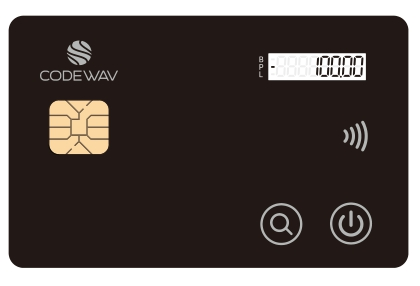
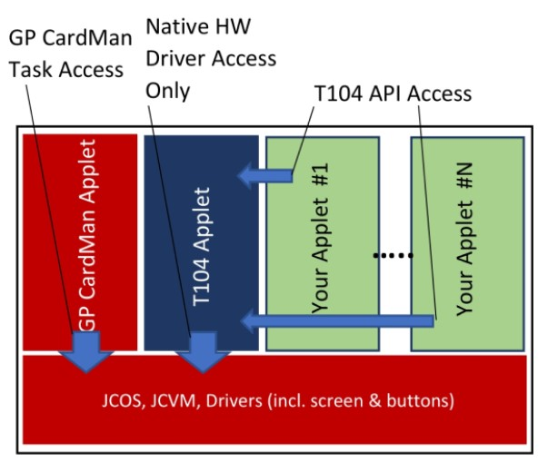
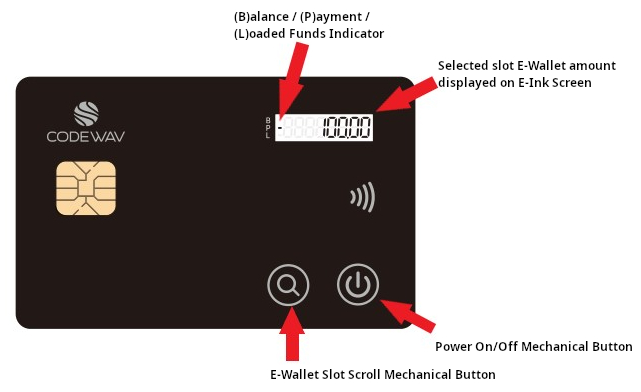

# ThothTrust THETAKey T104 #

## About THETAKey T104 ##

The THETAKey T104 smart card is a non-rechargeable and highly advanced JavaCard capable smart card with an embedded e-Ink figits display screen with that displays one single line of integer digits or a decimal digit with two decimal places.

Two mechanical buttons, one operating the power On/Off and the other allowing the scrolling of an internal eWallet feature allow users to interact with the smart card.

The T104 product aims to provide a more affordable variant to the T101 while giving up on some aspects of enhanced security that T101 provides to end users.

The THETAKey family with their Open APIs, allows end users to simply utilize existing JavaCard programming language to create their own JavaCard applets or to re-use existing off-the-shelf JavaCard applets with minimal changes to existing JavaCard applet codebases while being able fully utilize the security framework and capabilities provided by the THETAKey family of OpenAPIs.
 

### Licenses and Intellectual Properties Notices ###
This code repository abides by BSD-3 Clause license found in [LICENSE](LICENSE) file.

The APIs, documents, notes, markdown files, text files and all files are copyleft and available to everyone openly and freely. Replication, use and production are freely allowed as long as the BSD-3 Clause license is applicable whenever possible for the source codes available in this code repository.

## Product Naming Convention ##

The T104 product code designation for the THETAKey product denotes the first variant of the THETAKey smart card and subsequent variant will see the numerical changes while retaining the initial 'T' designation for the THETAKey product line. Due to the possibility of expanding the product line beyond an advanced smart card, numerical designations would be used to indicate the different hardware variants that the THETAKey devices that are available.

## THETAKey T104 Physical Characteristics ##
* ISO-14443 (Contactless/NFC) physical and electrical compliant
* CC EAL 6+ smart card chip (THD-89 chip)
* Single line E-Ink display
* 2 mechanical power & scroll buttons
* Non-chargeable internal battery
  
## The THD-89 Common Criteria Secure MicroController Certification ##
* Note that the certification does not apply to the JCOS or other applets and libraries not specified in the Common Criteria document.
* [https://www.commoncriteriaportal.org/files/epfiles/2018-36-INF-3198.pdf](https://www.commoncriteriaportal.org/files/epfiles/2018-36-INF-3198.pdf)

## THETAKey T104 Subsystems ##

The THETAKey subsystems available:
* Single line digits display
* Key Manager & E-Wallet system with secure management capabilities
* Open API

## THETAKey T104 JavaCard Components Architecture ##

The THETAKey T104 JavaCard hosts multiple proprietary applets and packages that gives access to the numerous physical hardware (i.e. E-Ink screen). ThothTrust have developed an OpenAPI built on top of a Key Manager framework to allow client card applications to freely and securely access the OpenAPI via calling the Shareable Interface of the KM104 Key Manager Applet from the client card application.

An E-Wallet system has also been baked into the Key Manager to provide a single unified E-Wallet system for storing of Stored Value funds in the card.

A client card application is required to register it's presence and setup an Application Container within the THETAKey Key Manager environment so as to allow secure resource access while providing gaurantees that the access calls are authenticated from the registered client application's end to prevent malicious spoofing of API access calls.

Unlike the T101, the T104 restricts all access to its OpenAPI to registered applets. There are two layers of security for the T104 due to the presence of a centrally managed E-Wallet System within the T104 card. Registration of applet to the Key Manager does not provide access to the E-Wallet System. A unique Admin account embedded within the T104 Key Manager with a default PIN code provides access to the E-Wallet management region of the E-Wallet System to give give access or revoke access to registered applets to the E-Wallet System.

The following T104 OpenAPI calls accessing the E-Wallet features are restricted to approved registered applets by the card's Key Manager Admin account to access:
* setGlobalWalletAmount() - For setting and updating funds stored in the E-Wallet
* getGlobalWalletAmount() - For retrieving funds stored in the E-Wallet

## THETAKey T104 NFC Access ##
### General Access ###
The NFC access is physically coupled to the power button and the embedded battery. The card's NFC is NOT ACCESSIBLE if the power is not switched on as the NFC and secure element is coupled to and uses the power from the embedded battery instead of the power from the NFC energy emitted from the host machine. The coupling of the NFC and secure element to the internal battery also acts as a hardware switch to prevent NFC proximity hacking as the card must be switched on to gain access to the secure element chip and other card features. 

Managing card applets will also require the power to be switched on and will drain the card's battery gradually. It is recommended that developers plan out their releases ahead of time before programming the card.

The card is essentially unusable if the battery is damaged or insufficient power is available from the battery.

Be sure to bake a backup function on your applets to allow migration of important data between cards.

### THETAKey T104 NFC Timeout ###
The ThetaKey T104 configuration is set to have a default timeout of 5 minutes (300 seconds) upon detection of idle activity which will automatically power off the card once the card times out. The card's timeout function can be switched on and off and the duration for timeout can be controlled either via the OpenAPI or via access to the T104 Manager.

Any registered applet may fetch the duration of the card's timeout and whether the card's timeout timer is in the on or off state.

From the T104 OpenAPI, the following methods provides timeout access capabilities:
* setCardTimeout() - For setting the timeout duration as well as toggling on or off the timeout function.
* getCardTimeout() - For retrieving the timeout duration as well as the status of the timeout timer setting.

### A Word Of Caution ###
When deciding to edit the card's timeout settings either from the Open API or via the T104 Manager, it is strongly advisable not to switch off the timeout timer as this will leave your card permanently switched on until you use the physical power button to turn the card on or off to physically switch off the card. The card would be rendered useless once the card's non-rechargeable battery is fully drained.

The card's timeout timer is shared globally and developers have to anticipate that there maybe other applets on the card and adjusting the timeout settings from your card applet may affect other applets too. Care must be taken when handling the timeout timer.

Card Admins with administrative access to the T104 Manager may overwrite the global timeout settings and care must be taken when editting the timeout settings of the card.

## T104 KeyManager and OpenAPI Components Architecture ##

Access to the unique T104 features requires the access to the Key Manager via registered Containers to allow a controlled and secure access to native resources. The Key Manager is currently capable of:

* Applet Object Container - up to 10 applet containers

JavaCard Applets that lack the access to Applet Object Containers (AOC) are still capable of using the standard JavaCard and GlobalPlatform APIs without any negative side effects. Up to the maximum amount of applets may be registered with the T104 Key Manager via the OpenAPI. Each applet is represented by an AOC and a mutually shared PIN up to a 64 byte PIN of any 8 bit octet string maybe used.

During the initial applet registration to the Key Manager via the createAOCContainer() call, a randomly or chosen PIN binary string chosen or generated by the applet or user is also given to the Key Manager for use in a mutual authentication scheme. The PIN is securely stored in the Key Manager using a 256-bit Storage Encryption Key that is randomly generated (RandomData.	ALG_SECURE_RANDOM) and held as an AESKey object during the initialization of the Key Manager applet and is never exported out of the Key Manager. All PINs are encrypted with Cipher.ALG_AES_CBC_PKCS5 mode of operation.

An E-Wallet container also exists in the Key Manager applet for the E-Wallet system. A single slot for 'balance' unit of funds, a single slot for 'pay' unit of funds and a single slot for 'load' unit of funds are shared by all registered and authorized applets for the E-Wallet System. All registered and authorized applets tap these slots freely and care must be taken when manipulating these funds as incorrect manipulation of funds may affect other applets using the E-Wallet System. The E-Wallet System does not contain any logic for incrementing, decrementing, partial or full refunding of funds. It is simply a storage data slot and it requires the applets to do the manual manipulation and then updating of the funds.

## T104 E-Wallet Access Management ##

A T104Manager tool is found under the Tools folder that contains the source code and executable JAR file binary for the management tool to manage the E-Wallet System as the KeyManager Administrator role.

There are no backup PIN or PUK to recover a 'lost' KeyManager Administrator role. A total of 5 retries is available before an account lockout is executed thus rendering the management of the E-Wallet feature impossible.

The default Administrator PIN for the KeyManager Administrator role is '12345678'. It is highly advisable to change the administrative PIN upon receiving the card to another PIN via the T104Manager tool.

The T104Manager tool provides the ability to enable or disable access to the E-Wallet feature but does not provide any direct access to the data stored in the E-Wallet container or to manipulate the data stored in the E-Wallet container.

The connection between the T104Manager and the KeyManager applet uses a proprietary secure channel protocol that allows a one-time OTP code derived from the asymmetric keyed session handshake to be displayed on the card's screen for verification that the secure channel connection has not been tampered with.

## T104 E-Wallet Acceptable Data Types ##
The T104 E-Wallet may accept ASCIIFied positive integers and decimal numbers. One example is 123.45 has to be represented in bytes as 0x3132332E3435. The wallet slots may either be integer only or decimal only. If integers only input, only up to 8 digit input is accepted. If decimal is used, only up to 2 decimal place with up to 6 integers is accepted.

When updating the E-Wallet record slots, you have to choose to either display the 'balance', 'pay' or 'load' funds slot data onto the screen. The key value for the constants of the slots are below.

* T104OpenAPI.WALLET_BALANCE_RECORD_SLOT
* T104OpenAPI.WALLET_PAYMENT_RECORD_SLOT
* T104OpenAPI.WALLET_LOADING_RECORD_SLOT

Some examples of acceptable inputs:
* 123456.78
* 12345678

Some examples of unacceptable inputs:
* 123.45678
* 1234567890

## Page Links ##
* [Product Overview](README.md)
* [Basic User Manual](Basic%20User%20Manual.md)
* [Developer Guide](Developer%20Guide.md)
* [Developer Samples Guide](Developer%20Samples%20Guide.md)
* [JavaDoc API](javadoc/index.html)
* [T104 Applet APDU Guide](T104%20Applet%20APDU%20Guide.md)

## THETAKey Product Page ##
* [https://thothtrust.com/products.html#thetakey](https://thothtrust.com/products.html#thetakey)
* Email to purchase a sample [here](mailto:sales@thothtrust.com).
